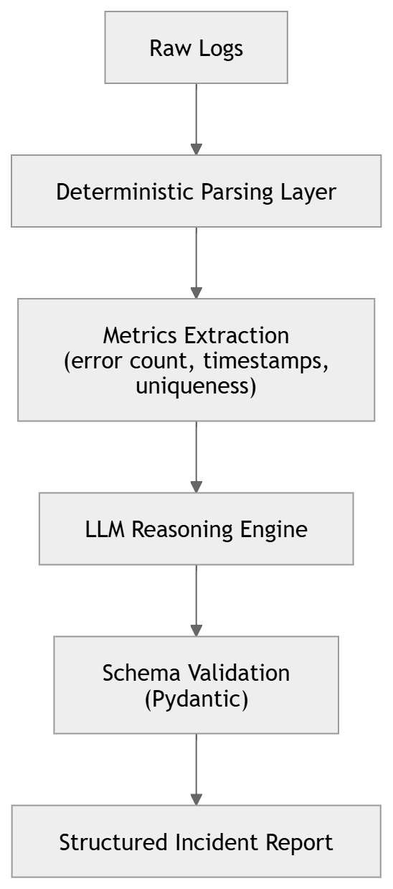
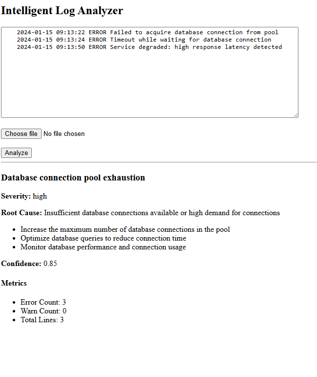
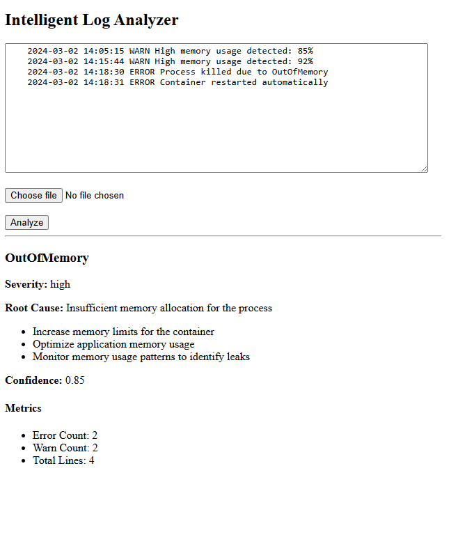

# Intelligent Log Analyzer

### Guardrailed AI-Assisted Incident Intelligence Service

A hybrid deterministic + LLM-powered incident analysis system designed
to improve incident triage reliability while reducing hallucination risk
in production environments.

------------------------------------------------------------------------

## System Overview

This system combines:

-   Deterministic log parsing
-   Structured metrics extraction
-   Constrained LLM reasoning
-   Strict schema validation (Pydantic)

The goal is to balance reliability with contextual intelligence.

------------------------------------------------------------------------

## Architecture

------------------------------------------------------------------------

## LLM Guardrails

-   JSON-only output instruction
-   Pydantic schema validation before rendering
-   Low temperature (0.2) for reduced variability
-   Controlled log truncation to manage context size
-   Output rejection on validation failure

------------------------------------------------------------------------

## Example Scenario 1 --- Database Connection Pool Exhaustion

### Input Logs

2024-01-15 09:13:22 ERROR Failed to acquire database connection from
pool\
2024-01-15 09:13:24 ERROR Timeout while waiting for database connection\
2024-01-15 09:13:50 ERROR Service degraded: high response latency
detected

### Output Screenshot

------------------------------------------------------------------------

## Example Scenario 2 --- Memory Leak / OOM Restart

### Input Logs

2024-03-02 14:05:15 WARN High memory usage detected: 85%\
2024-03-02 14:15:44 WARN High memory usage detected: 92%\
2024-03-02 14:18:30 ERROR Process killed due to OutOfMemory\
2024-03-02 14:18:31 ERROR Container restarted automatically

### Output Screenshot

------------------------------------------------------------------------

## Configuration & Environment Variables

This service requires an OpenAI API key.

### 1. Create Environment File

Copy the example file:

.env.example → .env

### 2. Add Your API Key

Inside `.env`:

OPENAI_API_KEY=your_openai_api_key_here

### 3. Security Notes

-   The `.env` file is excluded from version control.
-   API keys must never be committed to the repository.
-   In production environments, environment variables should be injected
    via:
    -   Cloud secret manager
    -   CI/CD pipeline secrets
    -   Container environment configuration

Environment variables are loaded using `python-dotenv`.

------------------------------------------------------------------------

## Running Locally

Install dependencies:

pip install -r requirements.txt

Start the server:

uvicorn app.main:app --reload

Open:

http://127.0.0.1:8000

------------------------------------------------------------------------

## Failure Modes Considered

-   Malformed JSON from LLM
-   Missing structured fields
-   Overconfident confidence scoring
-   Truncated context hiding deeper root causes
-   Increased inference latency

------------------------------------------------------------------------

## Token & Cost Considerations

-   Logs are truncated to control token usage
-   Deterministic preprocessing reduces prompt size
-   Low temperature reduces retry frequency
-   Future improvement: hash-based caching layer

------------------------------------------------------------------------

## Tech Stack

-   FastAPI
-   Async OpenAI SDK
-   Pydantic
-   Jinja2
-   Python 3.10+

------------------------------------------------------------------------

## Positioning

This project demonstrates:

-   Applied LLM system design
-   Guardrailed AI integration
-   Structured output enforcement
-   Reliability-focused AI engineering
-   Cost-aware prompt orchestration
